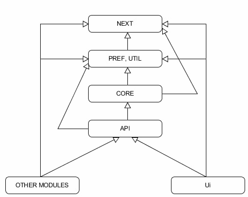

## **Green White Solutions kompaniyasining backend dasturlashga oid stardartlari**
&nbsp;
## Mundarija

- [Module tushunchasi](https://github.com/iamsardorbek/markdown_test#module-tushunchasi)
- [Module ning setup papkasi](https://github.com/iamsardorbek/markdown_test#module-ning-setup-papkasi)
- [Module ning paketlari (packages)](https://github.com/iamsardorbek/markdown_test#module-ning-paketlari-packages)
- [Module lar ierarxiyasi](https://github.com/iamsardorbek/markdown_test#module-lar-ierarxiyasi)
- [Jadvallar (tables)](https://github.com/iamsardorbek/markdown_test#jadvallar-tables)
- [UI ga tegishli asosiy standartlar](https://github.com/iamsardorbek/markdown_test#ui-ga-tegishli-asosiy-standartlar)
- [UI dagi query lar](https://github.com/iamsardorbek/markdown_test#ui-dagi-query-lar)
- [Hisobotlarning (reports) style lari](https://github.com/iamsardorbek/markdown_test#hisobotlarning-reports-style-lari)
- [O&#39;zgaruvchilar (variables)](https://github.com/iamsardorbek/markdown_test#ozgaruvchilar-variables)
- [Umumiy standartlar](https://github.com/iamsardorbek/markdown_test#umumiy-standartlar)

&nbsp;
&nbsp;
## Module tushunchasi

***Module*** – bu o&#39;xshash maqsadga ega fayllarni bir joyga to&#39;plab turuvchi loyiha qismi. Loyiha _(project)_ modullardan tashkil qilinadi.

*Masalan:*
***mr*** – bu qisqa nomning negizida &quot;m references&quot; iborasi (&quot;m&quot; – anor loyihasiga tegishli _module_ larning prefiksi) turadi va bu _module_ ma&#39;lumotnomalarga (references, «справочники») tegishli fayllarini o&#39;z ichiga oladi.
***md*** – bu qisqa nomning negizida &quot;m deals&quot; iborasi turadi va bu _module_ buyurtma va tovarlarni qaytarishga *(«заказы и возвраты»)* tegishli fayllarini o&#39;z ichiga oladi.
Yangi _module_ ga loyihaga ma&#39;sul shaxs tomonidan qisqa nom beriladi.

&nbsp;
&nbsp;
## _Module_ ning _setup_ papkasi

_Module_ ning setup papkasida nomida quyidagi kalit so&#39;zlar mavjud .sql fayllar bo&#39;lishi mumkin:
1. _table_ – _module_ ga tegishli jadvallar *(tables)*, jadvallarga tegishli izoh *(comment)* va indekslar *(index)* yaratadigan kod. Aksariyat _module_ larda javdallar mavjud.
    1.1. _Module_ ning jadval va ularga tegishli ma&#39;lumotlarni saqlovchi fayl nomi quyidagi standart bo&#39;yicha beriladi: ***module\_nomi\_table.sql***.
*Masalan:* ```md_table.sql```, ```ms_table.sql```.
    1.2. Bu fayllar _prompt_ operatsiyasi bilan boshlanishi kerak. Bu tufayli .sql fayl dasturchi ishiga qulay bo&#39;lgan _command window_ da ochiladi. Aks holda, fayl _sql window_ da ochiladi va dasturchining ishi noqulay bo&#39;lishi mumkin.
    1.3. Bu fayldagi jadval, ustun, constraint va indekslar nomlari **kichik harflarda** berilishi zarur.
1. _sequence – module_ ga tegishli _sequence_ larni yaratuvchi kod.
    2.1. _Module_ ning sequence larini saqlovchi fayl nomi quyidagi standart bo&#39;yicha beriladi: ***module\_nomi\_ + &quot;sequence.sql&quot;***.
*Masalan:* ```md_sequence.sql```, ```mfm_sequence.sql```.

1. _setting – module_ ga tegishli sozlamalar *(settings)* qiladigan kod. Bu o&#39;z ichiga jadvallarni ichidagi boshlang&#39;ich ma&#39;lumotlarni va sozlamalarni to&#39;ldirishni oladi.
     3.1. _Module_ ning sozlamalarini qiluvchi fayl nomi quyidagi standart bo&#39;yicha beriladi: ***module\_nomi\_ + &quot;setting.sql&quot;***.
*Masalan:* ```mph_setting.sql```, ```mr_setting.sql```.

&nbsp;
&nbsp;
## Module ning paketlari (packages)

_Module_ ning nomida quyidagi kalit so&#39;zlar mavjud paketlar *(package)* bo&#39;lishi mumkin:

1. core – boshqa _module_ lardan funksiyalarni yashirish uchun va API da biror-bir kod bloklarini qayta yozmaslik uchun ishlatiladigan paket.
2. api – **ui** da ishlatiladigan asosiy operatsiyalarning *(save, update, delete)* funksiyalarini o&#39;z ichiga oladigan paket.
3. pref – module ga tegishli konstantalar *(constant)*, o&#39;zgaruvchilar *(variable)*, tiplar *(types)*, sozlamalar *(settings)* va ularni qaytaruvchi funksiyalarni saqlaydigan paket.
    3.1. Konstantalar nomida &quot;c\_&quot; prefiksi bo&#39;lishi zarur.
    3.2. Agar biror konstantani sql faylning ichida ishlatish zaruriyati bo&#39;lsa, kerakli konstanta uchun &quot;c\_&quot; prefikssiz xuddi shu nom bilan wrapper funksiya yaratiladi.
*Masalan:*
```sql
Function Company_Head return number is
begin
  return c_Company_Head;
end;
```
4. global – global o&#39;zgaruvchi *(variable)* va tip *(type)* larni o&#39;z ichiga oladigan paket.
2. next – _module_ ga tegishli _sequence_ lar ning navbatdagi *(next)* elementlarini olish uchun ishlatiladigan paket.
    5.1. _Sequence_ ning navbatdagi *(next)* elementini olish uchun _sequence_ ga to&#39;g&#39;ri murojaat qilib bo&#39;lmaydi. Buni amalga oshirish uchun sequence paketidagi tegishli funksiyani chaqirish kerak.
*Masalan:*
        - ```v_role_id := md_next.role_id;``` - standartga mos
        - ```v_role_id := md_roles_sq.nextval;``` - standartga mos emas
    5.2. next paketidagi funksiya nomi tablening yagonaligini _(uniqueness)_ ta&#39;minlovchi column nomi bilan bir xil bo&#39;lishi kerak.
1. util – bu nomning negizida &quot;utility&quot; so&#39;zi olingan bo&#39;lib, bu paket yordamchi va foydalanuvchining ishini osonlashtiruvchi protsedura va funksiyalarni o&#39;z ichiga oladi.
2. watcher –_module_ ga tegishli ma&#39;lumotlarga taaluqli _watcher_ larni kodi yoziladigan paket.
3. audit – _module_ ga tegishli ma&#39;lumotlarni _audit_ qilishga tegishli kod yoziladigan paket.

&nbsp;
&nbsp;
## Module lar ierarxiyasi

1. _Module_ lar orqali qat&#39;iy ierarxiya quriladi. Natijada biror-bir _module_ faqat o&#39;zi va o&#39;zidan yuqori _module_ (lar)ga murojaat qilishi mumkin. _Module_ lar ierarxiyasi quyidagi sxemada ko&#39;rsatilgan.

1. Bundan tashqari, _module_ lar ierarxiyasini har bir loyihada mavjud bo&#39;lgan start.sql fayllarida ko&#39;rishingiz mumkin. start.sql faylining vazifasi - barcha _module_ lar paketlarini ishga tushurish.
_xcore_ loyihasining start.sql faylidan bir parcha:
```
prompt ==== **start Core** ====
prompt ==== MD ====
@@md\md_env.pck;
@@md\md_global.pck;
@@md\md_next.pck;
@@md\md_pref.pck;
@@md\md_util.pck;
@@md\md_core.pck;
@@md\md_api.pck;
@@md\md_lang.pck;
@@md\md_watcher.pck;
@@md\md_audit.pck;
@@md\md_smtp.pck;
prompt ==== MA ====
@@ma\ma_next.pck;
@@ma\ma_pref.pck;
@@ma\ma_util.pck;
@@ma\ma_core.pck;
@@ma\ma_api.pck;
@@ma\ma_user.pck;
prompt ==== MS ====
@@ms\ms_global.spc;
@@ms\ms_next.pck;
@@ms\ms_pref.pck;
@@ms\ms_util.pck;
@@ms\ms_core.pck;
@@ms\ms_api.pck;
@@ms\ms_watcher.pck;
@@ms\ms_audit.pck;
prompt ==== MT ====
@@mt\mt_next.pck;
@@mt\mt_pref.pck;
@@mt\mt_util.pck;
@@mt\mt_api.pck;
@@mt\mt_tape.pck;
@@mt\mt_fcm.pck;
```
start.sql da keltirilgan _module_ lar fayldagi tartibiga asoslanib, faqatgina o&#39;zidan teparoqda keltirilgan _module_ larning paketlarini ishlata oladi. Tepadagi kodda turli _module_ larga tegishli paketlar ma&#39;lum bir tartibda yozilgan: _MD, MA, MS, MT_. Bu tartibdan quyidagi hulosalarni qilishingiz mumkin:
- _MD module_ faqatgina o&#39;zining paketlarini ishlata oladi, boshqa _module_ larning paketlarini ishlata olmaydi.
- _MA module_ o&#39;ziningva _MD module_ ning paketlarini ishlata oladi.
- _MS module_ o&#39;zining, _MD_ va _MA module_ larning paketlarini ishlata oladi.
- _MT module_ o&#39;zining, _MD, MA_ va _MS module_ larning paketlarini ishlata oladi.


&nbsp;
&nbsp;
## Jadvallar (tables)

1. Jadval nomiga prefiks qilib _module_ nomi qo&#39;shilishi zarur.
Masalan: ```md_persons```, ```ms_notifications```.
1. Jadval yaratilayotganda ustunlar *(columns)* quyidagi tartibda bo&#39;ladi: company\_id (agar mavjud bo&#39;lsa), _primary key_ ustunlari, va ustunlar oxirida, agar mavjud bo&#39;lsa, tegishli tartibda _state_, _code_, _pcode_ joylashadi.
2. Jadvallar ```GWS_DATA_tablespace``` da saqlanadi.
3. Indekslar ```GWS_INDEX_tablespace``` da saqlanadi.
4. Jadvalga tegishli har bir _constraint_ nomi jadval nomi bilan boshlanib, tegishli suffiks qo&#39;shib yozilishi zarur:
    5.1. ```primary key```: &quot;\_pk&quot;.
*Masalan:* ```md_persons_pk```.
    5.2. ```foreign key```: &quot;\_f1&quot;, &quot;\_f2&quot;.
*Masalan:* ```md_persons_f1```, ```md_persons_f2```.
    5.3. ```unique``` constraint: &quot;\_u1&quot;, &quot;\_u2&quot;.
*Masalan:* ```md_persons_u1```, ```md_persons_u2```;
    5.4 . ```check``` constraint: &quot;\_c1&quot;, &quot;\_c2&quot;.
*Masalan:* ```md_persons_c1```, ```md_persons_c2```.
1. Jadval uchun yaratilgan indekslar quyidagi suffikslar ishtirokida nomlanadi:
    6.1. ```unique index```: &quot;\_u1&quot;, &quot;\_u2&quot;. _Unique index_ lar tartib sonlari unique constraint bilan birga hisoblanadi. Yani, unique index lardan oldin 2-ta unique constraint berilgan bo&#39;lsa, birinchi unique index nomi &quot;\_u3&quot; suffiksi bilan beriladi.
*Masalan:* ```md_persons_u3```, ```md_persons_u4```.
    6.2. oddiy _index_: &quot;\_i1&quot;, &quot;\_i2&quot;. 
    *Masalan:* ```md_persons_i1```, ```md_persons_i2```.
1. Agar _foreign key_ ustunlar _unique index_ ga kiritilmagan bo&#39;lsa, ular uchun alohida indeks yaratilishi zarur.
```sql
create table mcg_discount_cards(
  company_id                      number(20)        not null,
  discount_card_id                number(20)        not null,
  discount_type_id                number(20),
  person_id                       number(20),
  code                            number(13)        not null,
  expiry_date                     date,
  state                           varchar2(1)       not null,
  created_on                      date,
  constraint mcg_discount_cards_pk primary key (company_id, discount_card_id) using index tablespace GWS_INDEX,
  constraint mcg_discount_cards_u1 unique (discount_card_id) using index tablespace GWS_INDEX,
  constraint mcg_discount_cards_f1 foreign key (company_id, discount_type_id) references mcg_discount_types(company_id, discount_type_id) on delete cascade,
  constraint mcg_discount_cards_f2 foreign key (company_id, person_id) references md_persons(company_id, person_id),
  constraint mcg_discount_cards_c1 check (state in ('A', 'P'))
) tablespace GWS_DATA;

create unique index mcg_discount_cards_u2 on mcg_discount_cards(company_id, code) tablespace GWS_INDEX;

create index mcg_discount_cards_i1 on mcg_discount_cards(company_id, discount_type_id) tablespace GWS_INDEX;
create index mcg_discount_cards_i2 on mcg_discount_cards(company_id, person_id) tablespace GWS_INDEX;
```
Bu jadvalda o&#39;z ichiga (company\_id, discount\_card\_id) ustunlarini oluvchi mcg\_discount\_cards\_f1 nomli va o&#39;z ichiga (company\_id, person\_id) ustunlarini oluvchi mcg\_discount\_cards\_f2 foreign key lar bor. Bundan tashqari, bu jadvalda birgina unique index bor – mcg\_discount\_cards. U o&#39;z ichiga (company\_id, code) ustunlarini oladi. Ikkala foreign key unique index ga kiritilmagan, shuning uchun ular uchun alohida mcg\_discount\_cards\_i1 va mcg\_discount\_cards\_i2 nomli indekslar yaratilgan.

8. Har bir jadval uchun _&quot;comment on table&quot;_ operatsiyasi yordamida izoh yozilishi zarur.
*Masalan:* ```comment on table md_persons is 'All persons in the system';```
1. Jadval ustidagi _delete_, _update_, _insert_, _lock for update_ operatsiyalari jadvalga tegishli **z-paket** yordamida amalga oshiriladi. Z-paket – jadvalga tegishli yordamchi funksiya va protseduralarni o&#39;z ichiga oluvchi paket. Z-paketlar bo&#39;yicha to&#39;liq ma&#39;lumotni fazo\_z.run funksiyasida ko&#39;rishingiz mumkin.

&nbsp;
&nbsp;
## UI ga tegishli asosiy standartlar

1. Foydalanuvchi interfeysiga bog&#39;liq backend fayllar **ui** *(User Interface)* papkasidada saqlanadi.
2. ui module dan jadvallar ustida to&#39;g&#39;ridan-to&#39;g&#39;ri DML va DDL operatsiyalarini bajarish taqiqlanadi. ```Select``` operatsiyasi bundan istisno.
3. UI da jadvallarni ko&#39;rsatadigan formalar nomining oxirida &quot;\_list&quot; iborasi qo&#39;shilishi zarur.
*Masalan:* ```filial_list```, ```region_list```.
4. _Md\_Preferences_ jadvalidagi ```pref_code``` _va Md\_User\_Settings_ jadvalidagi ```setting_code``` ustunlarining qiymatini berish uchun ishlatiladigan _varchar type_ dagi konstantalar qiymati **&quot;UI\_path\_code:&quot;** prefiksi bilan bo&#39;lishi zarur (&quot;path\_code&quot; o&#39;rnida tegishli path\_code yoziladi).
*Masalan:* ```c_pref_short_name constant varchar2(100) := 'UI_CORE1:show_short_name'```
1. UI da ```temporary table``` larning nomi **&quot;ui\_path\_code\_&quot;** prefiksi bilan bo&#39;ladi. (&quot;path\_code&quot; o&#39;rnida _temporary table_ ning tegishli path\_code yoziladi).
*Masalan:* ```ui_2374_quantities```
Tepadagi 4 va 5 qoidalar ma&#39;lumot qatorlarining _unique_ ligini kafolat qilishi uchun mavjud.
1. UI paketlarda har bir hisobotda *(report, rep)* maqsadiga qarab ```order by``` kalit so&#39;zi yordamida saralash bo&#39;lishi zarur.
2. UI da _invoice_ va _integration_ kabi hisobotlar ko&#39;p bo&#39;lgani tufayli ularga nom berayotganda hisobot tartibli raqamini so&#39;zlar bilan suffiks qilib qo&#39;shib yozish zarur. 
*Masalan:* ```invoice_one```, ```invoice_two```, ```integration_one```, ```integration_two```.
3. UI paketining funksiyasi **b-paketning translate** (```b.translate()```) funksiyasini chaqirganida, birinchi parametrga paket nomini prefiks qilib beradi.
*Masalan:*
```b.Translate('UI-CORE1:' || i_Message, i_P1, i_P2, i_P3, i_P4, i_P5)```
Paket _module_ ga tegishli bo&#39;lsa (masalan: _md\_util, md\_core, md\_api_), birinchi parametrga _module_ ning nomini prefiks qilib beradi.
*Masalan:*
```b.Translate('MD:' || i_Message, i_P1, i_P2, i_P3, i_P4, i_P5)```
1. ```t()``` funksiyasiga parameter sifatida faqat _string_ berish zarur. ```t()``` funksiyasiga o&#39;zgaruvchi, _string_ ustida funksiya, konkatenatsiya va boshqa amallar ishlatish mumkin emas, aks holda tarjimada xato va qiyinchiliklar kelib chiqishi mumkin.
*Masalan:*
```t('Name')``` – to&#39;g&#39;ri;
```t(v_text)``` – noto&#39;g&#39;ri.
1. UI da ma&#39;lum bir to&#39;plamga kirmaydigan elementlarga id berish uchun &#39;-1&#39; qiymati ishlatiladi. Bu holatni tekshirish uchun paketlarda alohida tekshiruvlar yoziladi. &#39;-1&#39; noim to&#39;plam kirmaydigan, &quot;null id&quot; lar uchun ishlatiladi, shuning uchun &#39;-1&#39; qiymatini berilgandan boshqa maqsadda ishlatish taqiqlanadi.
2. UI da _Dynamic query_ larga _Validation_ yozish shart._Validation_ – bu GWS dasturchilari tomonidan ishni osonroq va ishonchliroq qilish uchun kiritilgan operatsiya. _Validation_ ning vazifasi – kod ichida ishlatilgan obyektlar mavjudligini tekshirish. Agar kodda mavjud bo&#39;lmagan yoki _access_ chegaralangan obyektlar ishlatilgan bo&#39;lsa, Validation protsedurasida kompilyatsiya vaqtida xato chiqadi. Validation 2 usul orqali amalga oshiriladi: uie.x() funksiyasi va update operatsiyasi yordamida.
*Masalan:*
```sql
Procedure Validation is
  begin
    Uie.x(Ui.Filial_Id);
    Uie.x(Ui.User_Id);
  
    update Deal_Headers
       set Deal_Id         = null,
           Owner_Person_Id = null,
           User_Id         = null,
           Manager_Id      = null,
           Person_Id       = null,
           Deal_Date       = null,
           Delivery_Date   = null,
           Deal_Time       = null,
           State           = null;
    update Md_Users
       set User_Id = null,
           name    = null;
  end;
```
12. Agar UI paketda bir nechta qiymat orasidan birortasini tanlash kerak bo&#39;lsa, buning uchun konstantalar yaratish va ularni _model_ orqali html ga yuborish zarur.
*Masalan,* ```measure type``` ni _(Weight, Amount, Quant)_ orasida tanlash kerak bo&#39;lsa, konstantalar quyidagicha e&#39;lon qilinadi:
```java
c_weight constant varchar2(1):= 'W';
c_amount constant varchar2(1):= 'A';
c_quant constant varchar2(1):= 'Q';
``` 
Bundan so&#39;ng,konstantalar _model_ orqali html ga jo&#39;natiladi.
13. UI da hisobot (_report_) yaratilayotganda tushunarli bo&#39;lishi uchun hisobot bir nechta funksiya va protseduralarga bo&#39;lib yaratiladi. Xususan:
_run_ – bu yerda o&#39;zgaruvchilar filterlanadi
_print\_top_ – odatda filterlar nomi chiqariladi
_print\_body_ – reporting asosiy qismi bo&#39;ladi va reporting darajasiga qarab header, body, footer ga bo&#39;linadi, jadvallardan ma&#39;lumot shu qismda ko&#39;rsatiladi
_print\_bottom_ – bu qismda rekvizitlar, imzo maydonlari va hokazo chiqariladi, odatda _invoice_ larda ishlatiladi.

&nbsp;
&nbsp;
## UI dagi query lar

1. UI da jadvallarni ko&#39;rsatadigan formalarga tegishli qoidalar:
  1. Agar jadvalda ___state___ ustuni bo&#39;lsa, filtr ___active state___ ga sozlanadi.
  2. _ID, code, barcode_ yoki boshqa ma&#39;lumotni identifikatsiya qiluvchi ustunlar _extra filter, extra column, extra search_ sozlamalariga kiritilishi zarur
2. _query_ nomlari **&quot;Query\_&quot;** bilan boshlanishi zarur. ```select``` qilinayotgan ma&#39;lumotga qarab _query_ nomining ikkinchi qismi ko&#39;plikda berilishi zarur.
*Masalan:* ```Query_persons```, ```Query_payments```.
3. _Query_ da html ga jo&#39;natiladigan ma&#39;lumotlar saralanmaydi (```order by```). Ma&#39;lumotlar html da saralanishi zarur.

&nbsp;
&nbsp;
## Hisobotlarning (reports) style lari

1. Hisobotlarda ma&#39;lumot ko&#39;rsatilayotganda, **ma&#39;lumotlarning o&#39;rni** o&#39;zgaruvchi tipi bo&#39;yicha joylashadi:
    1.1. _number_ – o&#39;ngda.
    1.2. _char_ – chapda.
    1.3. _date_ – markazda.
2. Agarda hisobotda bir nechta _style_ larniishlatmoqchi bo&#39;lsangiz, ```current_style``` funksiyasiga ularni orasida bo&#39;shliq *(space)* qoldirib yozishingiz mumkin.
*Masalan:* ```a.current_style('root bold');```
3. Hisobotning qismlarida quyidagicha _style_larni ishlatish tavsiya qilinadi:
    3.1. **top** da ```root```, ```bold```
    3.2. **body** da ```header```, ```body```
    3.3. **footer** da ```footer```

&nbsp;
&nbsp;
## O&#39;zgaruvchilar (variables)

1. O&#39;zgaruvchilar nomi ma&#39;noli, qisqa va tushunarli bo&#39;lishi zarur
2. O&#39;zgaruvchilar tipiga qarab nomiga quyidagi prefikslar qo&#39;shiladi:
    2.1. _global_ o&#39;zgaruvchilar: &quot;g\_&quot;.
*Masalan:* ```g_product_id```
    2.2. _in_ o&#39;zgaruvchilar: &quot;i\_&quot;.
*Masalan:* ```i_product_id```
    2.3. _out_ o&#39;zgaruvchilar: &quot;o\_&quot;.
*Masalan:* ```o_product_id```
    2.4. _in__out_ o&#39;zgaruvchilar: &quot;p\_&quot;.
*Masalan:* ```p_product_id```
    2.5. _translate_ o&#39;zgaruvchilar: &quot;t\_&quot;.
*Masalan:* ```t_product_id```
    2.6. funksiya ichida o&#39;zgaruvchilar: &quot;v\_&quot;.
*Masalan:* ```v_product_id```
    2.7. _watcher_ o&#39;zgaruvchilar: &quot;w\_&quot;.
*Masalan:* ```w_new_filial_id```
    2.8. _rowtype_ o&#39;zgaruvchilar: &quot;r\_&quot;.
*Masalan:* ```r_product```
    2.9. _record\_type_ o&#39;zgaruvchilar: &quot;v\_&quot;.
*Masalan:* ```v_item```, ```v_product```
3. Quyidagi harflarini yolg&#39;iz o&#39;zini o&#39;zgaruvchi nomi sifatida ishlatish tavsiya qilinmaydi: &quot;b&quot; (birunida b-paket mavjud), &quot;t&quot; (tarjimada funksiya qilib ishlatilgan), &quot;z&quot; (jadvallar uchun ishlatilgan), &quot;p&quot; (_frontend_ qismidan keladigan parametrlar uchun), &quot;l&quot; (1 raqamiga o&#39;xshagani uchun), &quot;o&quot; (0 raqamiga o&#39;xshagani uchun).
4. Tarjimonga tushunarli bo&#39;lishi uchun tarjima qilinadigan o&#39;zgaruvchilarga to&#39;liq va tushunarli nom berish kerak. Agar faqat $1, $2 lar yozilsa, bu nima ekanligini { } qavslar ichida yozish zarur.
*Masalan:* ```t('$1 {begin_date} - $2 {end_date}')```
5. Ko&#39;plikni bildiruvchi o&#39;zgaruvchilar nomiga &quot;s&quot; qo&#39;shilib yozish zarur.
*Masalan:* ```v_product_ids```, ```g_person_groups```.
6. UI paketda ko&#39;pincha ishlatiladigan ```Hashmap``` ning &quot;r\_&quot; va &quot;o\_&quot; bilan nomi boshlangan har bir o&#39;zgaruvchi tipi uchun funksiyalar mavjud. Bu funksiyalar parametriga ```hashmap``` dagi _key_ beriladi. Quyida bu funksiyalarga tegishli qoidalar tushuntirilgan.
*Masalan:* ```p.o_varchar2('key')```, ```p.r_varchar2('key')```, ```p.r_number('key')```.
    6.1. &quot;r\_&quot; – parametrda jo&#39;natilgan _key_ ning _value_ si hashmap da mavjud bo&#39;lishi shart, aks holda funksiya xato qaytaradi.
    6.2. &quot;o\_&quot; - parametrda jo&#39;natilgan _key_ ning _value_ si hashmap da mavjud bo&#39;lmasa ham xato qaytarmaydi.

&nbsp;
&nbsp;
## Umumiy standartlar

1. Yangi _module_ yaratilsa yoki mavjud module ga yangi paket qo&#39;shilsa, uning fayllarini ```start.sql``` va ```start_all.sql``` fayllariga qo&#39;shish zarur. ```start_all.sql``` faylining vazifasi – loyihaga tegishli barcha obyektlarni (table, sequence, setting va hokazo) yaratish va ```start.sql``` faylini ishga tushurish.
2. Jadvalda tizim tomonidan to&#39;ldiriladigan qatorlar *(rows)* mavjud bo&#39;lsa, bu jadvalga ```pcode``` (pcode - private code) ustuni qo&#39;shiladi. Masalan, turli regionlar tizim orqali boshlang&#39;ich ma&#39;lumot sifatida kiritiladi; demak, regionlar jadvaliga pcode ustuni qo&#39;shiladi.
3. ```.html``` va ```.pck``` fayllar nomi **kichik harflarda** berilishi zarur.
4. _path_ – bu loyihaning ichida ma&#39;lum-bir paketni joylashgan &quot;manzili&quot;, yo&#39;li. **path code** har bir loyiha uchun yaratilgan sxema orqali olinadi.
_path_ va uning _code_ ning misollari:
path – ```"/trade/widgets/room_plan"```, code – ```"trade2"```;
path – ```"/anor/imp/bank"```, code – ```"1203"```;
path – ```"/deal/cheque/cheque_one"```, code – ```"deal6"```.
5. Loyihada ```setup``` nomli papka bo&#39;ladi, uning ichidagi ```init``` papkasida boshlang&#39;ich sozlash vazifasini bajaradigan quyidagi fayllar bo&#39;lishi mumkin: ```audit_info.sql```, ```job.sql```, ```project.sql```, ```table_info.sql```, ```watcher.sql``` va hokazo.
6. ```init``` papkasida ```project.sql``` fayli bo&#39;lishi shart.```project.sql``` faylida loyiha to&#39;g&#39;risida ma&#39;lumot md\_projects jadvaliga qo&#39;shiladi, loyihaning _intro\_form, module lari, parent_ loyihasiva boshqa shularga o&#39;xshash ma&#39;lumotlar beriladi.
7. Agarda funksiya **company\_id** ustuni mavjud bo&#39;lgan jadvaldan foydalanayotgan bo&#39;lsa, jadval company\_id ustuni bo&#39;yicha filterlanishi zarur. Buning 2 usuli bor. Birinchisi – funksiyaga company\_id parameter kirib kelishi orqali, ikkinchisi esa company\_id global o&#39;zgaruvchiga saqlangan xolatda.
8. **Migratsiya** fayllarining nomi pull request qabul qilingan sanaga bog&#39;liq. Bundan tashqari, fayl yuklatilgan _branch_ ga qarab fayl nomiga tegishli suffiks qo&#39;shiladi. Migratsiya fayllarini nomi quyidagi standartda beriladi: _**MM\_YYYY(DD\_#).sql**_, qavsdagi &quot;#&quot; o&#39;rnida brachga tegishli suffiks bo&#39;ladi, fayl master _branch_ da bo&#39;lsa _branch_ suffiksi qo&#39;yilmaydi.
*Masalan:* ```10_2020(4).sql```, ```11_2021(06_d).sql```, ```11_2021(07_h).sql```.
9. Har bir funksiya yoki protseduradan oldin 100-ta ```-``` belgisi qo&#39;yiladi.
10. Har bir funksiya yoki protseduradam keyin bo&#39;sh qator qoldiriladi.
11. Har bir funksiya va protseduraga izoh _(comment)_ yozish zarur. To&#39;liq malumot **&quot;Izohlar qoldirish&quot;** dokumentatsiyasida.
12. Formaga tegishli ```.html``` va ```.pck``` fayllar nomlari bir xil bo&#39;lishi zarur.
13. Barcha nomlar va izohlar **ingliz tilida** berilishi zarur. Ma&#39;noli nomlar tanlashga loyiha ma&#39;sul hodim javob berishi zarur.
14. Paket spetsifikatsiyasiga *(package specification)* faqatgina _public_ funksiya, protsedura, o&#39;zgaruvchi va konstantalarni chiqazish kerak.
15. Konstantalar nomida &quot;c\_&quot; prefiksi bo&#39;lishi zarur.
16. Konstantalar ```constant``` kalit so&#39;zi yordamida yaratilishi zarur.
17. ```pref```, ```util``` paketlari funksiya va protseduralariga murojaat qilib ishlatiladigan o&#39;zgaruvchi va funksiyalar ```Fazo_Query``` ga parameter orqali berilishi kerak. Masalan: ```filial_id``` bo&#39;yicha tekshirish kerak bo&#39;lsa, tekst ichida ```:filial_id``` ko&#39;rinishida ishlatiladi. Buni quyidagi kod parchasida ko&#39;rishingiz mumkin.

```sql
q := Fazo_Query('select *
                       from Mr_Vans v
                      where v.state = ''A''
                        and exists (select 1 
                                      from mrf_vans f
                                     where f.van_id = v.van_id
                                       and f.filial_id = :filial_id)
                        and (Lower(v.Name) like Lower(:name)
                         or Lower(v.Van_Number) like Lower(:name))',
                    Fazo.Zip_Map('filial_id',
                                 Ui.Filial_Id));
```                                 
